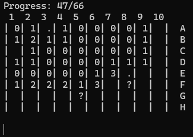

# Rusty Minesweeper
This is a reincarnation of the classic minesweeper game.

# Key features
- Minimalistic, command line interface
- Written in Rust, guaranteed to be extremely memory safe & efficient
- Stat tracking (defused mines, explosions, safe tiles uncovered)
- Hints to help you when you stuck

# How to play
After selecting a map size, you need to uncover all the 'safe' tiles. A tile is safe, if it doesn't contain a mine.  
To uncover a tile, type its position, like `a1` or `57BC`. Then this tile will show a number, that number is the number of mines in the sorrounding 8 tiles.

If you sure about a tile to be mine, you ~~should~~ can defuse it.  
Type `def C4` to mark that tile as mine without uncovering it, it will show as a `.`

If you changed your mind, type the same command to remove the mark from that tile.

If you not sure about a tile, you can place a `?` on it.  
Type `mark f8` to place a `?` on the `f 8` tile.

When you don't know how to proceed, you can use a hint - it will uncover one random safe tile.  
Just type `hint`.

*Don't hesitate, the first tile is never going to be a mine.*

## Can you clear an XL map?
## Can you reveal 500 tiles without exploding?
## Try it now!